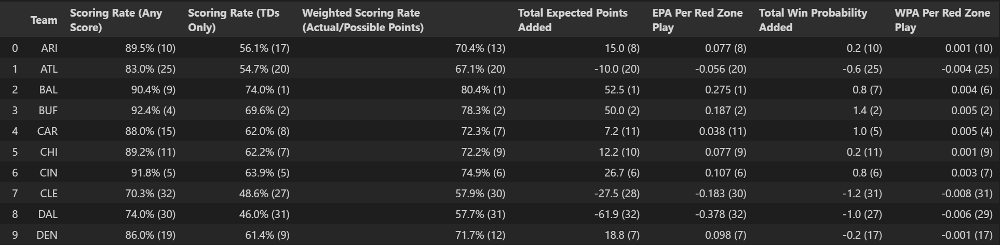
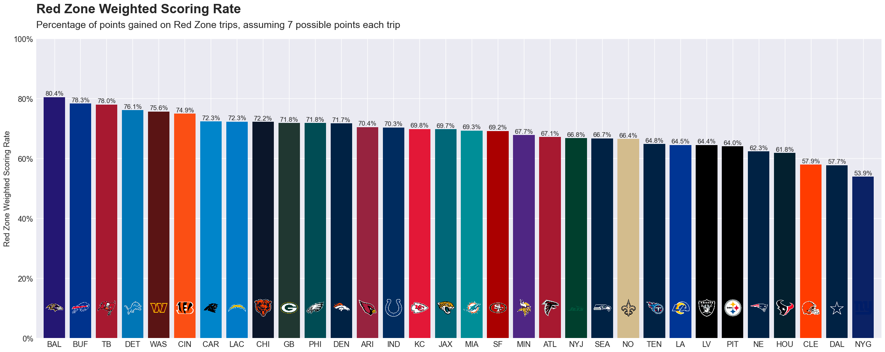

# Weighted Red Zone Efficiency

## Overview

NFL offensive red zone efficiency is commonly measured by touchdown rate (percentage of red zone trips resulting in a touchdown) or scoring rate (percentage of red zone trips resulting in any score). While more advanced metrics like Expected Points Added (EPA) or Win Probability Added (WPA) on red zone opportunities may be more comprehensive measures of success, the rate statistics are commonly reported by broadcasts for simplicity and familiarity.

What may find a happy medium is a metric that is more precise than the existing scoring rates but is still simpler and more familiar to common fans than EPA or WPA. A weighted red zone scoring rate could represent that balance. The weighted red zone scoring rate proposed here would improve upon the overall scoring rate by penalizing teams for scoring field goals rather than touchdowns; it would improve upon the touchdown rate by rewarding teams for not turning the ball over and scoring any points.

## Methodology

The weighted scoring rate is the percentage of possible points scored across all red zone trips. Actual points on each red zone possession (3, 6, 7, or 8) are summed and then divided by the total possible points from those possessions (assumed to be 7 for each trip). The assumption of 7 possible points is imprecise but a reasonable starting point. The expected value of a touchdown is slightly less than 7 because: 1) PAT attempts are successful less than 100% of the time, and 2) 2-point conversion attempts are successful less than 50% of the time.

In the Jupyter Notebook [file](redzone_efficiencies.ipynb), play-by-play data from the first 10 weeks of the 2024 NFL season were accessed using `nfl_data_py`. Red zone scoring rate, touchdown rate, weighted scoring rate, and respective rankings were calculated for each team. For additional comparison, total EPA, EPA per play, total WPA, and WPA per play in the red zone were also calculated and ranked for each team. A preview of the first ten teams is displayed in the table below.

Bar charts were also created for each of the 7 red zone efficiency metrics to compare teams visually. Team colors and logos were also accessed from `nfl_data_py` and used in these charts. The chart of weighted scoring rates is displayed below.

## Conclusions

I would argue that the weighted scoring rate is a more holistic red zone metric than either the overall scoring rate or the touchdown rate. The weighted metric improves on the overall rate by rewarding teams for scoring touchdowns over field goals, but it also improves on the touchdown rate by rewarding teams for not turning the ball over and converting field goals.

The biggest beneficiaries of switching from overall rate to weighted rate would be teams with a below-average scoring rate and above-average touchdown rate. These teams may be more aggressive in attempting 4th-down conversions instead of field goals. They may also be more prone to turnovers. These teams are touchdown or bust.

- CAR: 19th Overall -> 8th Weighted (+11)
- PHI: 27th Overall -> 16th Weighted (+11)
- JAX: 28th Overall -> 18th Weighted (+10)
- NO: 21st Overall -> 13th Weighted (+8)
- CHI: 15th Overall -> 8th Weighted (+7)

The biggest beneficiaries of switching from touchdown rate to weighted rate would be teams with an above-average scoring rate and below-average touchdown rate. These teams may be more conservative about attempting fields rather than 4th-down conversions. They may also be less prone to turnovers. These teams are determined to come away with points.

- WAS: 16th TD Rate -> 7th Weighted (+9)
- GB: 29th TD Rate -> 23rd Weighted (+6)
- KC: 17th TD Rate -> 12th Weighted (+5)
- IND (19->15), LAC (18->14), PIT (25->21) tied at +4

Just 2 teams would benefit from a change to weighted scoring rate regardless of the status quo metric. These teams have very similar rankings between overall scoring rate and touchdown rate. They may also benefit from success on PAT and 2-point conversion attempts, which are a factor in the weighted average.

- BUF: 9th Overall, 7th TD Rate -> 6th Weighted
- CLE: 12th Overall, 13th TD Rate -> 11th Weighted
- Several other teams have a weighted rate tied with their scoring rate or touchdown rate.

Note: the statistics above are accurate as of Week 10 of 2024.

The advanced metrics of Expected Points Added (EPA), Win Probability Added (WPA), and their respective per-play averages are still considered more comprehensive and precise metrics. However, scoring rate and touchdown rate are still preferred by broadcasts and major media outlets because of their familiarity with fans. If weighted scoring rate could be introduced as an alternative, it could be a happy middle ground between the basic rates and advanced metrics—more precise than the rates and more digestible than EPA or WPA.

## Attribution

A big thank you to nfl_data_py and nflfastR for making this data available. Y'all do amazing work to democratize sports analytics.
